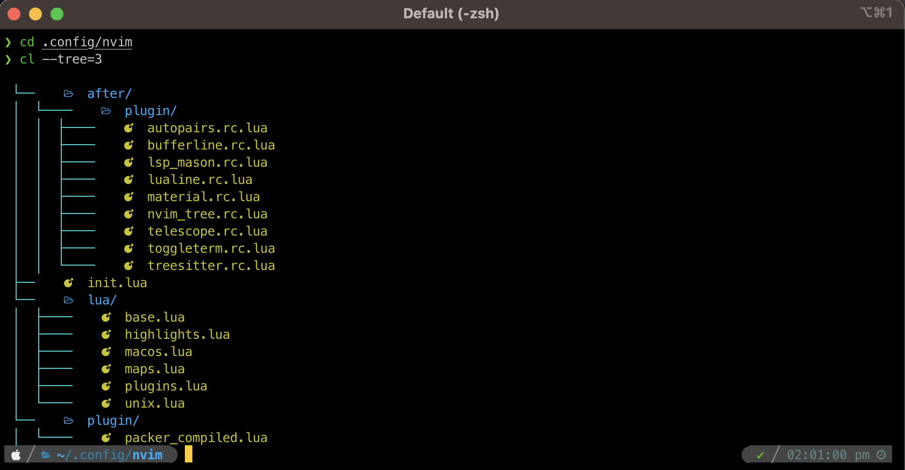
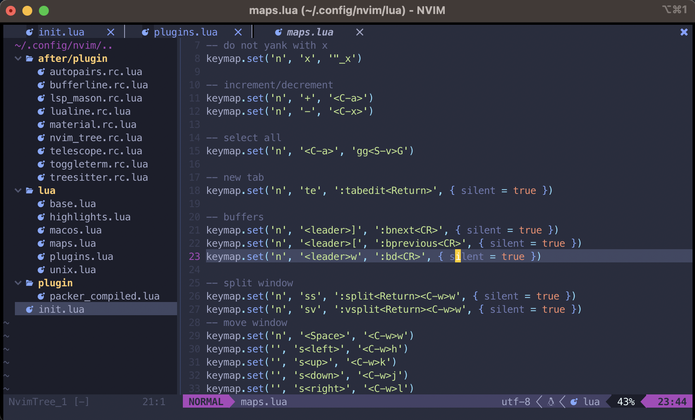

# dotfiles

## setup steps

**get files locally**

Assuming we are in our user's home directory
```
cd ~
```

1. cloning repo
```
git clone --bare https://github.com/jesse-rb/dotfiles.git ~/.dotfiles
```

2. for now, set alias to checkout repo, this line is also present in `.zshrc` for later
```
alias dotfiles='/usr/bin/git --git-dir=$HOME/.dotfiles/ --work-tree=$HOME'
```

3. checkout main branch
```
dotfiles checkout
```

4. hide untracked files for dotfiles bare repo
```
dotfiles config --local status.showUntrackedFiles no
```

At this point all dotfiles should already be in place :D, no need to `mv` or `cp` things around (hopefully?)

**install basics**

5. The available scripts are more for a list of commands to reference at the moment, running them may not work properly. It is worth noting that sourcing `.zshrc` might complain with warnings until some things referenced in the install scripts have been installed

e.g. `cat ~/scripts/ubuntu-install.sh` or `cat ~/scripts/macos-install.sh`

## previews




